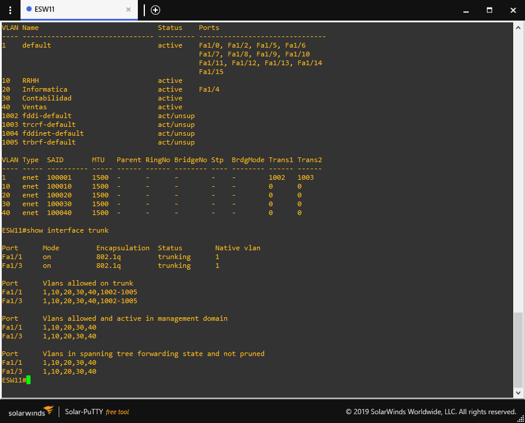

# Redes 1 - Proyecto 1 - Grupo #9

| *Nombre* | *Carnet* | *Ipv4* |
| - | - | - |
| César Alejandro Chinchilla González | 201612132 | 10.8.0.2 |
| Miguel Fernando Guirola Villatla | 201700772 | 10.8.0.3 |
| Herbert Steve González Camey | 201900122 | 10.8.0.4 |
| Nery Oswaldo Jiménez Contreras | 201700381 | 10.8.0.6 |

# Conexión a VPN
1. Se procede a deshabilitar el `firewall` en cada una de las computadoras


1. Se establece la conexión hacia la `VPN` creada en la Tarea #3.


# Topología general del proyecto


# Distribución `IPV4` para la topología

| *VPC* | *DIRECCIÓN DE RED* | *GATEWAY* | *VLAN* |
| - | - | - | - |
| RRHH_1 | 192.168.91.11/24 | 192.168.91.1 | 10 |
| RRHH_2 | 192.168.91.12/24 | 192.168.91.1 | 10 |
| RRHH_3 | 192.168.91.13/24 | 192.168.91.1 | 10 |
| RRHH_4 | 192.168.91.14/24 | 192.168.91.1 | 10 |
| Informatica_1 | 192.168.92.11/24 | 192.168.92.1 | 20 |
| Informatica_2 | 192.168.92.12/24 | 192.168.92.1 | 20 |
| Informatica_3 | 192.168.92.13/24 | 192.168.92.1 | 20 |
| Conta_1 | 192.168.93.11/24 | 192.168.93.1 | 30 |
| Conta_2 | 192.168.93.12/24 | 192.168.93.1 | 30 |
| Conta_3 | 192.168.93.13/24 | 192.168.93.1 | 30 |
| Conta_4 | 192.168.93.14/24 | 192.168.93.1 | 30 |
| Ventas_1 | 192.168.94.11/24 | 192.168.94.1 | 40 |
| Ventas_2 | 192.168.94.12/24 | 192.168.94.1 | 40 |
| Ventas_3 | 192.168.94.13/24 | 192.168.94.1 | 40 |

# Topología 1 - Área de trabajo
1. Creamos la topología del área de trabajo.


##  Se configura el switch `ESW1`


* Configurando puertos `f1/0`, `f1/1` y `f1/2` en `modo trunkal` para la comunicación con `ESW2`, `ESW3` y la `Nube`.

```
 enable
 configure terminal 
 
 interface range f1/0-2
 switchport mode trunk
 switchport trunk allowed vlan 1,10,20,30,40,1002-1005
 no shutdown
 exit
 ```

* Configurado el `dominio`, `versión vtp` y `modo` del switch.

```
vtp domain GRUPO9
vtp password grupo9
vtp version 2
vtp mode client
end
```

* Guardando configuración del switch.

```
copy running-config startup-config
```

## Se configura el switch `ESW2`


* Configurando puertos `f1/0` y `f1/2` en `modo trunkal` para la comunicación con `ESW1` y `ESW3`.

```
enable
configure terminal 

interface range f1/0 - 1
switchport mode trunk
switchport trunk allowed vlan 1,10,20,30,40,1002-1005
no shutdown
exit
```

* Configurando las `VPC's` de la vlan `RRHH`.

```
interface range f1/2 - 3
switchport mode access
switchport access vlan 10 
no shutdown
exit
```

* Configurando las `VPC's` de la vlan `Conta`.

```
interface f1/4
switchport mode access
switchport access vlan 30 
no shutdown
exit
```

* Configurado el `dominio`, `versión vtp` y `modo` del switch.

```
vtp domain GRUPO9
vtp password grupo9
vtp version 2
vtp mode client
end
```

* Guardando configuración del switch.

```
copy running-config startup-config
```

## Configurando switch `ESW3`.


* Configurando puertos `f1/0` y `f1/2` en `modo trunkal` para la comunicación con `ESW1` y `ESW2`.

```
enable
configure terminal 

interface range f1/0 - 2
switchport mode trunk
switchport trunk allowed vlan 1,10,20,30,40,1002-1005
no shutdown
exit
```

* Configurando `VPC's` para la vlan `Conta`.

```
interface f1/3
switchport mode access
switchport access vlan 30 
no shutdown
exit
```

* Configurando `VPC's` para la vlan `Ventas`.

```
interface f1/4
switchport mode access
switchport access vlan 40 
no shutdown
exit
```

* Configurando `VPC's` para la vlan `Informática`.

```
interface f1/5
switchport mode access
switchport access vlan 20 
no shutdown
exit
```

* Configurado el `dominio`, `versión vtp` y `modo` del switch.

```
vtp domain GRUPO9
vtp password grupo9
vtp version 2
vtp mode client
end
```

* Guardando configuración del switch.

```
copy running-config startup-config
```

## Configurando las `VPC's` de las `vlans` conectadas a la `Topología 1`.

* Configuración de `RRHH_1`

```
ip 192.168.91.11 255.255.255.0 192.168.91.1
save 
```

* Configuración de `RRHH_2`

```
ip 192.168.91.12 255.255.255.0 192.168.91.1
save 
```

* Configuración de `Informatica_1`

```
ip 192.168.92.11 255.255.255.0 192.168.92.1
save 
```

* Configuración de `Conta_1`

```
ip 192.168.93.11 255.255.255.0 192.168.93.1
save 
```

* Configuración de `Conta_2`

```
ip 192.168.93.12 255.255.255.0 192.168.93.1
save 
```

* Configuración de `Ventas_1`

```
ip 192.168.94.11 255.255.255.0 192.168.94.1
save 
```

## Configuración de `puerto UDP` de la `Nube`.

* Conexión `UDP` hacia `Topología 2`


# Topología 2 - Backbone

1. Creamos la topología del Backbone.


## Configurando switch `ESW4`.


* Creando la `vlan 10` para el departamento de `RRHH`.

```
enable
configure terminal

vlan 10 
name RRHH
exit
```

* Creando la `vlan 20` para el departamento de `Informática`.

```
vlan 20
name Informatica
exit
```

* Creando la `vlan 30` para el departamento de `Contabilidad`.

```
vlan 30 
name Contabilidad
exit
```

* Creando la `vlan 40` para el departamento de `Ventas`.

```
vlan 40 
name Ventas
exit
```

* Configurando los puertos `f1/0`,`f1/1` y `f1/2` en `modo trunkal` para las conexiones hacia `Nube`,`ESW5` y `ESW7`

```
interface range f1/0 - 2
switchport mode trunk
switchport trunk allowed vlan 1,10,20,30,40,1002-1005
no shutdown
exit
```

* Configurado el `dominio`, `versión vtp` y `modo` del switch.

```
vtp domain GRUPO9
vtp password grupo9
vtp version 2
vtp mode server
```

* Configuraldo el `puente` de las `vlans`.

```
spanning-tree vlan 1 root primary
spanning-tree vlan 10 root primary
spanning-tree vlan 20 root primary
spanning-tree vlan 30 root primary
spanning-tree vlan 40 root primary
end
```

* Guardando configuración del switch.

```
copy running-config startup-config
```

## Configurando switch `ESW5`.


* Configurando los puertos `f1/1`,`f1/2` y `f1/3` en `modo trunkal` para las conexiones hacia `ESW4`,`ESW6` y `ESW7`

```
enable
configure terminal

interface range f1/1 - 3
switchport mode trunk
switchport trunk allowed vlan 1,10,20,30,40,1002-1005
no shutdown
exit
```

* Configurando el puerto `f1/0` en modo `access` para la topología `Informática`.

```
interface f1/0
switchport mode access
switchport access vlan 20 
no shutdown
exit
```

* Configurado el `dominio`, `versión vtp` y `modo` del switch.

```
vtp domain GRUPO9
vtp password grupo9
vtp version 2
vtp mode client
end
```

* Guardando configuración del switch.

```
copy running-config startup-config
```

## Configurando switch `ESW6`.


* Configurando los puertos `f1/1` y `f1/2` en `modo trunkal` para las conexiones hacia `ESW5` y `ESW7`

```
enable
configure terminal

interface range f1/1 - 2
switchport mode trunk
switchport trunk allowed vlan 1,10,20,30,40,1002-1005
no shutdown
exit
```

* Configurado el `dominio`, `versión vtp` y `modo` del switch.

```
vtp domain GRUPO9
vtp password grupo9
vtp version 2
vtp mode client
end
```

* Guardando configuración del switch.

```
copy running-config startup-config
```

## Configurando switch `ESW7`.


* Configurando los puertos `f1/0`,`f1/1`, `f1/2` y `f1/3` en `modo trunkal` para las conexiones hacia `ESW4`,`ESW5`,`ESW7` y `Nube`.

```
interface range f1/0 - 3
switchport mode trunk
switchport trunk allowed vlan 1,10,20,30,40,1002-1005
no shutdown
exit
```

* Configurado el `dominio`, `versión vtp` y `modo` del switch.

```
vtp domain GRUPO9
vtp password grupo9
vtp version 2
vtp mode client
end
```

* Guardando configuración del switch.

```
copy running-config startup-config
```

## Configurando las `VPC's` de las `vlans` conectadas a la `Topología 1`.

* Configuración de `Informatica_2`

```
ip 192.168.92.12 255.255.255.0 192.168.92.1
save 
```

## Configuración de `puerto UDP` de la `Nube`.

* Conexión `UDP` hacia `Topología 1`


* Conexión `UDP` hacia `Topología 3`


# Topología 3 - Zona de Servidores

1. Creamos la topología de la zona de servidores


## Configurando el switch `ESW8` 


* Se configuran las `VLAN Ventas` y los puertos `f1/0` y `f1/1 ` en modo `trunkal` hacia la `Nube y ESW9`

```
enable
config t

interface range f1/0 - 1
switchport mode trunk
switchport trunk allowed vlan 1,10,20,30,40,1002-1005
no shutdown
exit

* Configurando acceso a la `VLAN Ventas` en los puertos `f1/2` y `f1/3`

interface range f1/2 - 3
switchport mode access
switchport access vlan 40 
no shutdown
exit
```

* Configurado el `dominio`, `versión vtp` y `modo` del switch.

```
vtp domain GRUPO9
vtp password grupo9
vtp version 2
vtp mode client
end
```

* Guardando configuración del switch.

```
copy running-config startup-config
```

## Configurando el switch `ESW9` 


* Se asignan los puertos `f1/0`, `f1/1` y `f1/2` en modo `trunk`


```
enable
config t

interface range f1/0 - 2
switchport mode trunk
switchport trunk allowed vlan 1,10,20,30,40,1002-1005
no shutdown
exit
```

* Configurando acceso a la `VLAN Conta` en los puertos `f1/3` y `f1/4`

```
interface range f1/3 - 4
switchport mode access
switchport access vlan 30 
no shutdown
exit
```

* Configurado el `dominio`, `versión vtp` y `modo` del switch.

```
vtp domain GRUPO9
vtp password grupo9
vtp version 2
vtp mode client
end
```

* Guardando configuración del switch.

```
copy running-config startup-config
```

## Configurando switch `ESW10` 


* Se configuran los puertos `f1/0` y `f1/1` en modo trunk para la conexión hacia `ESW9` y `ESW11`

```
enable
config t

interface range f1/0 - 1
switchport mode trunk
switchport trunk allowed vlan 1,10,20,30,40,1002-1005
no shutdown
exit
```

* Configurando `VLAN RRHH` en los puertos `f1/2` y `f1/3`.

```
interface range f1/2 - 3
switchport mode access
switchport access vlan 10 
no shutdown
exit
```

* Configurado el `dominio`, `versión vtp` y `modo` del switch.

```
vtp domain GRUPO9
vtp password grupo9
vtp version 2
vtp mode client
end
```

* Guardando configuración del switch.

```
copy running-config startup-config
```

## Configurando switch `ESW11` 



* Se colocan los puertos `f1/1` y `f1/2` en modo trunk para la conexión hacia `ESW9` y `ESW10`

```
enable
config t

interface range f1/1 - 2
switchport mode trunk
switchport trunk allowed vlan 1,10,20,30,40,1002-1005
no shutdown
exit
```

* Configurando `VLAN Informática` en el puerto `f1/0`.

```
interface f1/0
switchport mode access
switchport access vlan 20 
no shutdown
exit
```

* Configurado el `dominio`, `versión vtp` y `modo` del switch.

```
vtp domain GRUPO9
vtp password grupo9
vtp version 2
vtp mode transparent
end
```

* Guardando configuración del switch.

```
copy running-config startup-config
```

## Configurando conexión `UDP` de la `Nube`

* Conexión `UDP` hacia `Topología 2`
  


# Test de `conexiones` entre `VPC's` de la misma `vlan`.

## Desde Topología 1

* `Ping` entre `Conta_1` y `Conta_2`.


* `Ping` entre `Conta_2` y `Conta_3`.


* `Ping` entre `Informatica_1` e `Informatica_2`.


* `Ping` entre `RRHH_1` y `RRHH_2`.


* `Ping` entre `Ventas_1` y `Ventas_2`.


## Desde Topología 2

* `Ping` entre `Informatica_2` e `Informatica_1`.


## Desde Topología 3

* `Ping` entre `Conta_3` - `Conta_1` y `Conta_3` - `Conta_2` .


---

